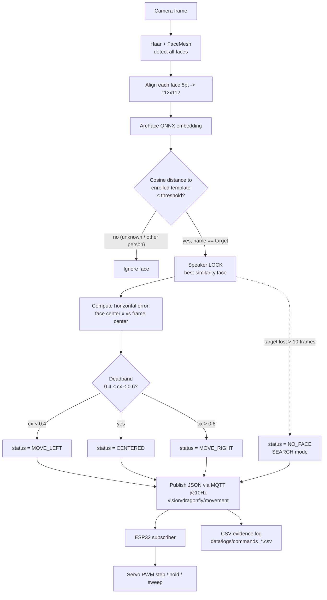

# Face Recognition with ArcFace ONNX and 5-Point Alignment


This project implements a **Distributed Face Recognition and Tracking System** for IoT-based servo control using:

- **ArcFace** model (ONNX) for face recognition
- **5-point facial landmark alignment** for precise face detection
- **MQTT** for distributed communication between components
- **ESP32** microcontroller for edge-based servo control (legacy ESP8266 firmware also included)
- **Real-time Web Dashboard** for system monitoring

The system is designed for **embedded systems applications**, demonstrating how computer vision, IoT communication, and edge computing work together in a practical face-tracking servo control system.

## Table of Contents

- [Assessment Details (Week 06)](#assessment-details-week-06)
- [System Architecture](#system-architecture)
- [Features](#features)
- [Project Structure](#project-structure)
- [Quick Start](#quick-start)
- [Usage](#usage)

## System Architecture

This distributed system consists of four main components:

1. **Vision Node (PC)**: Detects, recognizes, and tracks faces using ArcFace and MediaPipe. Publishes movement commands via MQTT.
2. **MQTT Broker (VPS)**: Central message broker facilitating communication between all components.
3. **ESP32 (Edge Controller)**: Subscribes to movement commands and controls a servo motor to physically track the detected face.
4. **Web Dashboard**: Real-time visualization of system status, tracking data, and lock status.

## Features

- **Face Recognition & Locking**: Lock onto a specific enrolled identity and track their movements
- **Distributed Architecture**: Components communicate via MQTT, allowing flexible deployment
- **Real-time Servo Control**: ESP32 controls servo motor based on face position
- **Live Dashboard**: Web-based monitoring with WebSocket updates
- **Action Detection**: Detects blinks, smiles, and head movements
- **CPU-friendly**: Runs on standard laptops without GPU requirements

## Project Structure

```
Face_recognition_with_Arcface/
├── src/
│   ├── vision_node.py       # Main vision processing + MQTT publisher
│   ├── face_locking.py      # Face locking & action detection
│   ├── haar_5pt.py          # Face detection core
│   └── recognize.py         # ArcFace recognition
├── backend/
│   ├── server.js            # MQTT-to-WebSocket relay
│   └── package.json
├── dashboard/
│   └── index.html           # Real-time web dashboard
├── esp32/
│   ├── vision_servo/
│   │   └── vision_servo.ino # Arduino firmware for ESP32 (primary)
│   ├── boot.py              # MicroPython alternative (WiFi setup)
│   └── main.py              # MicroPython alternative (MQTT + servo)
├── esp8266/                 # Legacy ESP8266 firmware (fallback)
├── data/
│   └── db/                  # Face database (face_db.npz)
└── models/
    └── embedder_arcface.onnx
```

## Quick Start

### 1. Install Dependencies
```bash
pip install -r requirements.txt
cd backend && npm install
```

### 2. Enroll Your Face
```bash
python -m src.enroll --name irere
```
Capture 10–30 samples (SPACE or `a` for auto-capture), then press `s` to save.

### 2.5. Select the Camera
If you have both a laptop webcam and a camera mounted on the servo, test each
OpenCV camera index and use the one that shows the servo-mounted camera:

```bash
python -m src.camera --index 0
python -m src.camera --index 1
python -m src.camera --index 2
```

Press `q` to close each preview window. The terminal prints the selected index:
`[camera] using camera index X`.

### 3. Start the System

**Terminal 1 (MQTT broker — local or VPS):**
```bash
mosquitto -c mosquitto.conf
```

**Terminal 2 (Backend / dashboard relay):**
```bash
cd backend
npm start                                # broker on localhost
# MQTT_BROKER=mqtt://<broker-ip> npm start  # broker elsewhere
```

**Terminal 3 (Vision Node):**
```bash
python src/vision_node.py --name irere               # broker on localhost
python src/vision_node.py --broker <broker-ip> --name irere
python src/vision_node.py --broker <broker-ip> --name irere --camera 1
# optional: --thresh 0.50  (stricter match; tune with: python -m src.evaluate)
# optional: --camera 1     (preferred OpenCV camera index)
```

### 4. Flash ESP32
Upload `esp32/vision_servo/vision_servo.ino` using Arduino IDE:

1. **Boards Manager**: install *"esp32 by Espressif Systems"*, then select your board (e.g. *ESP32 Dev Module*).
2. **Library Manager**: install **ESP32Servo** (Kevin Harrington) and **PubSubClient** (Nick O'Leary). The standard `Servo.h` does NOT work on ESP32.
3. **Edit the WiFi `ssid`/`password` and `mqtt_server` IP at the top of the sketch.**

**Wiring:**
| Servo wire | ESP32 pin |
|---|---|
| Signal (orange) | GPIO 18 |
| V+ (red) | VIN / 5V |
| GND (brown) | GND (must share ground with the signal) |

> If the board reboots when the servo moves (brownout), power the servo from a
> separate 5V supply (common GND with the ESP32) or add a large capacitor
> (470uF+) across the servo's power pins.

(A MicroPython alternative lives in `esp32/boot.py` + `esp32/main.py` — set WiFi in `boot.py` and the broker IP in `main.py`. Legacy ESP8266 firmware remains in `esp8266/`.)

The servo-mounted camera should still be connected to the PC as a USB camera.
The ESP32 controls the servo over MQTT; the PC vision node reads the camera and
publishes `MOVE_LEFT`, `MOVE_RIGHT`, `CENTERED`, or `NO_FACE` commands.

### 5. Access Dashboard
Open: `http://<backend-host>:8080` (e.g. http://localhost:8080)

## Assessment Details (Week 06)

### System Description
This project implements a **Distributed Face Recognition and Locking System** using:
1.  **Vision Node (PC)**: Detects, recognizes, and tracks faces using ArcFace and MediaPipe. Publishes movement commands.
2.  **MQTT Broker (VPS)**: Facilitates communication between the PC, ESP32, and Dashboard.
3.  **ESP32 (Edge)**: Subscribes to movement commands and controls a Servo motor to track the face.
4.  **Web Dashboard**: Visualizes the real-time blocking status and tracking info.

### MQTT Topics
-   `vision/dragonfly/movement`: small JSON payload with `status` (MOVE_LEFT, MOVE_RIGHT, CENTERED, NO_FACE), `confidence`, `target`, `locked`, `timestamp`. Published at 10 Hz; consumed by the ESP32 and dashboard.
-   `vision/dragonfly/snapshot`: same payload plus a base64 face crop (`face_image`). Kept separate so the large image never hits the embedded controller's 256-byte MQTT buffer (PubSubClient default on ESP32/ESP8266).
-   `vision/dragonfly/heartbeat`: health pings from the PC vision node and the ESP32.

### Command Mapping (assessment terminology)
| Assessment command | Published `status` | ESP32 behavior |
|---|---|---|
| LEFT | `MOVE_LEFT` | step servo (angle −3°) |
| RIGHT | `MOVE_RIGHT` | step servo (angle +3°) |
| STOP / CENTERED | `CENTERED` | hold position |
| SCAN / OUT_OF_FRAME | `NO_FACE` | sweep back and forth until the speaker is re-acquired |

### Recognize → Track → Command Pipeline (Activity 3 flowchart)



### Evidence Logging (Activity 5)
Every published command is appended to `data/logs/commands_<session>.csv`:
`timestamp, iso_time, speaker, confidence, command, locked`.
Facial action history (blinks, smiles, lock acquired/lost) is written to
`data/logs/<name>_history_<session>.txt`.

### Live Dashboard
**URL**: `http://<backend-host>:8080`

## Face Locking
The new Face Locking feature (`src/face_locking.py` and `vision_node.py`) allows you to track a single enrolled identity continuously.

**How it works:**
1.  **Search**: The system looks for the user using ArcFace recognition.
2.  **Lock**: Once found, it tracks the user's face position.
3.  **Action Detection**: It measures facial landmarks to detect:
    - **Blinks**: Using Eye Aspect Ratio (EAR).
    - **Smiles**: Using mouth width ratios.
    - **Movement**: Using nose position (Left/Right).

**History**:
A file named `data/logs/<name>_history_<timestamp>.txt` is created to record all detected actions, alongside the per-session command log `data/logs/commands_<timestamp>.csv`.
